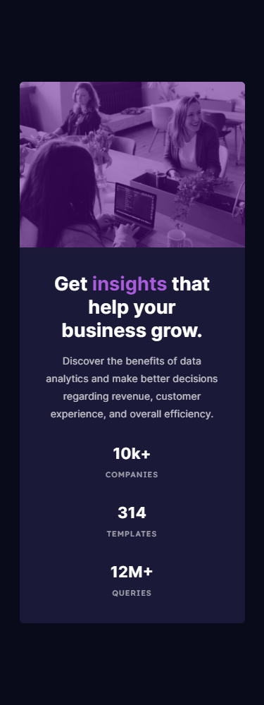

# Frontend Mentor - Stats preview card component solution

This is a solution to the [Stats preview card component challenge on Frontend Mentor](https://www.frontendmentor.io/challenges/stats-preview-card-component-8JqbgoU62). Frontend Mentor challenges help you improve your coding skills by building realistic projects. 

## Table of contents

- [Overview](#overview)
  - [The challenge](#the-challenge)
  - [Links](#links)
- [My process](#my-process)
  - [Built with](#built-with)
  - [What I learned](#what-i-learned)
  - [Continued development](#continued-development)
  - [Useful resources](#useful-resources)
- [Author](#author)
- [Screenshot](#screenshot)

## Overview

Cards group information and show a brief description of the content or a preview in a standard way.

Cards are a frequent use case, and we will need to be ready to identify and build these by front end developers.

### The challenge

Users should be able to:

- View the optimal layout depending on their device's screen size


### Links

- Solution URL: [github](https://github.com/redfox-mx/stats-card-preview)
- Live Site URL: [github pages](https://redfox-mx.github.io/stats-card-preview/)

## My process

First, I identify the design patterns. For this, it's a card element. Then, I divide the card into logic boxes (content and preview) that helps me to understand how CSS selectors should be applied since these logic boxes are "B" into the BEM methodology.

For the "content" section, I think about how content describes card information and stats. In that case, we have three main parts, heading, description and stats. Each one is an element inside the content box (E into BEM).

Then, for the "preview" section, all is around an image and how it provides context to the information. From the CSS perspective, you have a container with a preview image that changes its size according to the screen (media-query).

It could help me to choose logic and meaningful names for CSS selectors and HTML for the design.

### Built with

- Semantic HTML5 markup
- CSS custom properties
- Flexbox
- CSS Grid
- Mobile-first workflow
- BEM

### What I learned

I learned how UI works and how this helps me to build more reusable, no duplicated styles. And you can select more small and atomic pieces of UI as CSS class selectors.

```css
.card {}
.highlight {}
.content__title {}
.content__description {}
.content__stats {}
.preview {}
```

Second I learned to use picture elements to display images according to target attributes (screen width).

```html
<picture>
    <source srcset="path/to/image.jpg" media="(your-query)">
    
</picture>
```

### Continued development

Some layout strategies, actually one of my skills to improve is about applying layout properties like display flex, grid and sizes in an easy way and no override all rules into CSS to create a simple layout.

### Useful resources

- [Cómo colorear una imagen blanca o negra con CSS filter](https://nestordominguez.com/como-colorear-una-imagen-blanca-o-negra-con-css-filter/) - This article help me to undestand how css filter works and how diferrents filters can transform a image.

## Author

- Twitter - [@redfox_mx](https://www.twitter.com/redfox_mx)

## Screenshot


